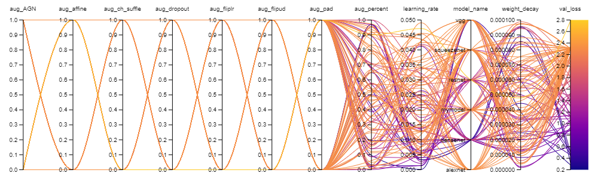

Updated: 31.01.2021

# Neural network training, using CIFAR-10 dataset
A showcase project for my coding practices and use of deep learning.

## Dataset
The CIFAR-10 dataset consists of 60 000 32x32 colour images in 10 classes, with 6000 images per class. There are 50 000 training images and 10 000 test images.

Below are 10 images visualized from each class:

## Results
With my trained neural network I was able to achieve 71.09% accuracy.

Below the image of resulting confusion matrix. Correct answers are shown on diagonal.

## Main features of this project
This project shows skills in following areas:

Pytorch, Docker, Git, file mangaement, commentting, hyperparamenter optimization, dataset management and transformation, knowledge in common neural networks and creation of neural networks and lastly correct model training, testing and early stoping practices.

## Hyperparameter optimization
Hyperparameter optimization was done using wandb and 6 runs were done. I used bayesian optmization with hyperband early stops.

Hyperparameters used were:
- Base Network
- Learning rate
- Weight decay
- 7 on and off augments
- Augmentation rate

For optimizer I used Adam and for loss I used CrossEntropyLoss.

